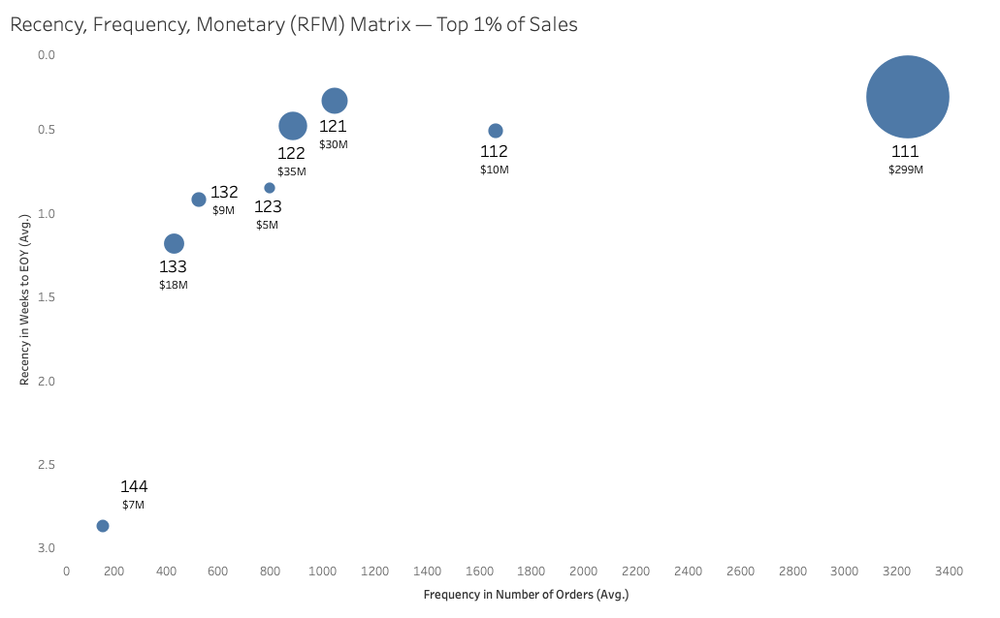

# Iowa Liquor Sales: RFM Segmentation Analysis

## Overview

Customer segmentation analysis of Iowa liquor retailers using RFM (Recency, Frequency, Monetary) scoring on 2025 state sales data. The goal was to identify distinct behavioral segments among ~2,600 stores and quantify revenue concentration across those segments.

**Dataset:** Iowa Department of Commerce — Liquor Sales (BigQuery Public Data, filtered to CY2025)  
**Tool:** BigQuery SQL  
**Grain:** One row per store, aggregated across all 2025 transactions

---

## Business Context

Iowa's liquor distribution system is state-controlled, meaning every licensed retailer — grocery stores, liquor stores, bars — purchases through a central system. This makes the dataset unusually clean: every transaction is recorded, there are no missing retailer IDs, and the data reflects the full population of active stores rather than a sample.

RFM segmentation here answers a practical question: **among ~2,600 stores, where is revenue actually concentrated, and which stores are at risk of lapsing?**

---

## Methodology

### Step 1 — Base Aggregation

Each store's RFM inputs were computed from raw transaction data:

```sql
WITH base AS (
  SELECT invoice_and_item_number, date, store_number, sale_dollars
  FROM `dataanalysisalpha.iowaLiquorSales.iowaLiquor2025filter`
),
prepgrain AS (
  SELECT
    store_number,
    COUNT(DISTINCT invoice_and_item_number) AS numPurchases,
    ROUND(SUM(sale_dollars), 2)             AS totalSales,
    MAX(date)                               AS latestInvoice,
    DATE_DIFF('2025-12-31', MAX(date), DAY) AS DiffDaysToEOY,
    DATE_DIFF('2025-12-31', MAX(date), WEEK) AS DiffWeekToEOY
  FROM base
  GROUP BY store_number
)
```

**Recency** is measured as weeks between a store's last purchase and December 31, 2025 — lower is better (more recent).

**Frequency** is the count of distinct invoices over the calendar year.

**Monetary** is total sales dollars over the calendar year.

### Step 2 — RFM Scoring

Each dimension was scored 1–4, where 1 = best:

- **Monetary & Frequency:** `NTILE(4)` over the store population, ordered descending. Auto-balances quartiles across the distribution.
- **Recency:** Manual CASE WHEN thresholds based on calendar quarters (0–13 weeks = Q4 purchaser = score 1, 14–26 weeks = Q3 = score 2, etc.).

> **Why manual thresholds for recency?** Initial NTILE scoring collapsed scores 1 and 2 — too many stores had purchased within the last few weeks, producing identical week values that NTILE couldn't meaningfully distinguish. Fixed calendar-quarter thresholds preserve the semantic meaning of recency: a Q4 purchaser is behaviorally different from a Q2 purchaser regardless of how many stores fall into each bucket.

### Step 3 — Segment Assignment

RFM scores were concatenated into a 3-digit segment code (e.g., `111` = top quartile on all three dimensions). Segments were then aggregated by store count and total revenue.

```sql
RFMQuartiles AS (
  SELECT
    numPurchases, totalSales, DiffWeekToEOY,
    NTILE(4) OVER (ORDER BY totalSales DESC)    AS salesQuartile,
    NTILE(4) OVER (ORDER BY numPurchases DESC)  AS purchQuartile,
    CASE
      WHEN DiffWeekToEOY <= 13 THEN 1
      WHEN DiffWeekToEOY <= 26 THEN 2
      WHEN DiffWeekToEOY <= 39 THEN 3
      ELSE 4
    END AS weeksQuartile
  FROM prepgrain
)

SELECT
  CONCAT(salesQuartile, weeksQuartile, purchQuartile) AS rfm_segment,
  COUNT(*)                                             AS store_count,
  ROUND(SUM(totalSales), 2)                           AS total_revenue
FROM RFMQuartiles
GROUP BY 1
ORDER BY SUM(totalSales) DESC
```

---

## Results



*Bubble chart showing segments that each represent ≥1% of total 2025 revenue. X-axis: average orders per store. Y-axis: average weeks to EOY (lower = more recent). Bubble size: total segment revenue.*

### Key Findings

**Revenue is highly concentrated.** Segment `111` — stores that rank in the top quartile on sales, recency, and frequency — accounts for $299M in revenue across 457 stores. The next largest segment (`122`) generates $35M, roughly 12% of `111`'s total. This is a classic power-law distribution.

**High-frequency stores are also recent stores.** The upper-right quadrant of the chart (high frequency, low weeks-to-EOY) clusters tightly, suggesting that ordering volume and ordering recency are correlated behaviors. There are no stores with high frequency but poor recency — if a store orders often, it ordered recently.

**Segment `414` represents the most actionable retention opportunity.** These stores rank in the top sales quartile and top frequency quartile but have not purchased recently (recency score = 1 in this case flags recent; 4 flags lapsed). At 360 stores and $6.9M in revenue, this is a meaningful at-risk segment.

**Segment `144` is the clearest lapsed-high-value group.** Poor recency, low frequency, but $7M in historical revenue — stores that were once active but have gone quiet. Worth flagging for a win-back strategy.

### Segment Summary (Top Segments by Revenue)

| Segment | Stores | Total Revenue | Description |
|---------|--------|---------------|-------------|
| 111 | 457 | $299M | Champions — high sales, recent, frequent |
| 122 | 344 | $35M | High sales, recent, mid frequency |
| 121 | 97 | $30M | High sales, recent, high frequency |
| 133 | 343 | $18M | High sales, recent, lower frequency |
| 112 | 86 | $10M | High sales, recent, high frequency (alt) |
| 414 | 360 | $6.9M | At Risk — high value, lapsed |
| 144 | 27 | $7M | Lapsed high-value |

---

## Analytical Notes

- **Unit of analysis is the store, not the individual transaction.** Monetary value reflects total annual spend per store, not average transaction size. A store ordering small quantities frequently could score similarly to one ordering large quantities infrequently — a known limitation of total revenue as the M dimension.
- **Calendar year reference point.** All recency scores are anchored to December 31, 2025. A store that last purchased in late December will have a recency score of 0–1 weeks regardless of order size or frequency.
- **Dataset is the full population, not a sample.** Standard errors and confidence intervals are not applicable here — these are population-level counts, not estimates.
